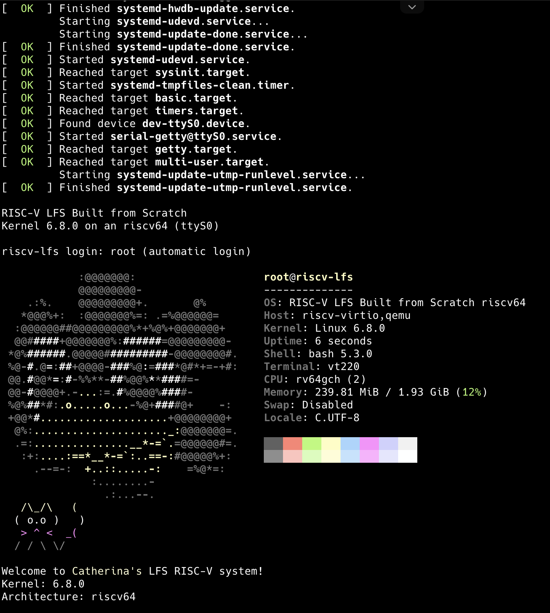

# 猫的试炼记录：

## 基本信息

- GitHub ID: `Catherina0`
- 宿主机平台: `macOS on Apple Silicon`
- 联系邮箱: `zitao.oerv@isrc.iscas.ac.cn`
- rootfs 发布 Repo: `https://github.com/Catherina0/lfs-riscv`

---

## 如何从 rootfs 运行起来


1. 完整下载 repo 中的文件
2. 确保 `run-qemu.sh`、`Image`、`rootfs-Catherina.cpio.gz` 位于同一目录
3. 赋予脚本执行权限：

```bash
chmod +x run-qemu.sh
```

4. 启动系统：

```bash
./run-qemu.sh
```

### fastfetch 证据!


---

### 这是如何锻造的 (LFS 过程简述)

#### 环境准备

在macOS（Apple Silicon）上使用docker构建了linux交叉编译环境，再面向riscv64进行构建。

#### 编译

参考Stage 1-2 的路线 从不带C库的最小化工具链开始编译，然后安装Linux头文件并编译Glibc，在此基础之上重建完整GCC工具链。

#### 根文件系统

在工具链完成后按照 Binutils -> Glibc -> Zlib -> Util-linux -> Libcap -> Systemd 的顺序进行交叉编译，通过Stub桩函数饶过了宿主机上无法进行的测试单元。

#### 内核编译

设计欢迎语，并编译Linux 6.8.0 内核，在 QEMU system mode 下完成验证。

### 你踩过的坑

1. macOS的APFS文件系统对大小写不敏感，所以会出现编译过程中文件互相覆盖，解决方法是通过docker创建ext4卷，与宿主机隔离

2. docker使用了 --rm 并且没有正确挂卷，导致电脑盒盖之后docker关闭，所有中间产物全丢。

3. glibc移除了旧接口，但是GCC还保留旧假设，crypt.h报错，解决方案是后续补上

4. rootfs初次打包过大，然后发现是把源码工具链全打进去了，后来通过限制目录解决。

5. systemd在交叉编译中包含一些无法在宿主机执行的检查和测试，通过Stub方法跳过，然后还需要处理一些编译器警告才能稳定完成构建

### 已知问题 / TODO (如有)

登录流程采用自定义包装脚本，而非完整传统 login/PAM 栈

### 许可与安全声明

我确认 rootfs 不包含任何密钥/Token/SSH Key/凭据/私人数据。
