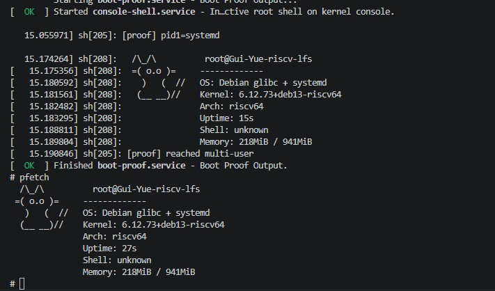

# Gui-Yue 的试炼记录

## 基本信息

- GitHub ID: Gui-Yue
- 联系邮箱: xiangwei.riscv@isrc.iscas.ac.cn
- rootfs 发布 Repo: https://github.com/Gui-Yue/RISC-V-From-Scratch

## Rootfs 资产

- 文件名: rootfs-riscv64-lfs-Gui-Yue.tar.zst
- SHA256: e9054e7604928e3a416ae7da8b3f66ff25fa7a3717d31840552a23e9bf2d9021
- 内核文件: Image
- 内核 SHA256: 753fa1d09ed92cc6bd4238edb7f91a36c12460fcc73309ec6ac0c23634358d64
- 预打包 initramfs: initramfs-systemd.cpio.gz
- initramfs SHA256: c19da581cbe90e9345edb098a40f7d0179ffbf6465fce141809b3095e19b6e52

## 如何从 rootfs 运行起来

> 目标：从“下载 rootfs”到“进入环境并跑起 pfetch / fastfetch”的最短步骤。

### 前置条件

- 宿主机 Linux x86_64
- 已安装 `qemu-system-riscv64`

### 方式 1（推荐，直接用 release 中的 initramfs）

1. 下载资产：

```bash
wget https://github.com/Gui-Yue/RISC-V-From-Scratch/releases/download/v1.1/rootfs-riscv64-lfs-Gui-Yue.tar.zst
wget https://github.com/Gui-Yue/RISC-V-From-Scratch/releases/download/v1.1/Image
wget https://github.com/Gui-Yue/RISC-V-From-Scratch/releases/download/v1.1/initramfs-systemd.cpio.gz
```

2. 启动 QEMU：

```bash
qemu-system-riscv64 \
  -machine virt \
  -m 1024M \
  -bios default \
  -kernel Image \
  -initrd initramfs-systemd.cpio.gz \
  -append "console=ttyS0 rdinit=/init systemd.getty_auto=0 loglevel=4" \
  -nographic
```

3. 进入后执行：

```bash
cat /proc/1/comm
/usr/bin/pfetch
/usr/bin/fastfetch --logo none
```

预期包含：
- `cat /proc/1/comm` 输出 `systemd`
- `pfetch` 输出中包含 `Arch: riscv64`
- `fastfetch` 输出中包含 `Kernel: Linux ...` 与 `OS: Debian GNU/Linux ... riscv64`

### 方式 2（从 rootfs 重新打包 initramfs）

```bash
mkdir -p rootfs

tar -I zstd -xvf rootfs-riscv64-lfs-Gui-Yue.tar.zst -C rootfs
(
  cd rootfs
  find . | cpio -o -H newc | gzip -9 > ../initramfs.cpio.gz
)

qemu-system-riscv64 \
  -machine virt \
  -m 1024M \
  -bios default \
  -kernel Image \
  -initrd initramfs.cpio.gz \
  -append "console=ttyS0 rdinit=/init systemd.getty_auto=0 loglevel=4" \
  -nographic
```

## fastfetch / neofetch 证据



## 这是如何锻造的（LFS 过程简述）

- 参考的教程/版本:
  - 本仓库 `readme.md` / `ROADMAP.md` / `CHECKLIST.md`
- 关键配置（toolchain / libc / 内核 / init / 包策略等）:
  - libc: glibc（Debian trixie, `2.41`）
  - init: systemd（Debian trixie, `257.x`）
  - 内核: `6.12.73+deb13-riscv64`
  - 用户态: `bash + coreutils + util-linux + dbus`，附带 `pfetch + fastfetch`
  - 启动方式: initramfs + QEMU system mode
- 与“原教旨 LFS”的偏离（如有）:
  - 用户态基线采用 Debian 交叉引导构建的 `riscv64` 根文件系统来完成 `glibc + systemd` 主线可运行闭环。

## 你踩过的坑

- 坑 1: `mmdebstrap` 产物在当前环境存在权限映射问题，需通过 user namespace 处理后再打包。
- 坑 2: 串口 `ttyS0` getty 在 initramfs 场景可能等待设备，需在启动参数中加 `systemd.getty_auto=0`，并使用控制台 shell 服务保证可用交互。

## 已知问题 / TODO（如有）

- 该产物目标是主线可启动与验证闭环，未覆盖完整 BLFS 生态与包管理工作流。

## 安全声明

- 我确认 rootfs 不包含任何密钥/Token/SSH Key/凭据/私人数据。
