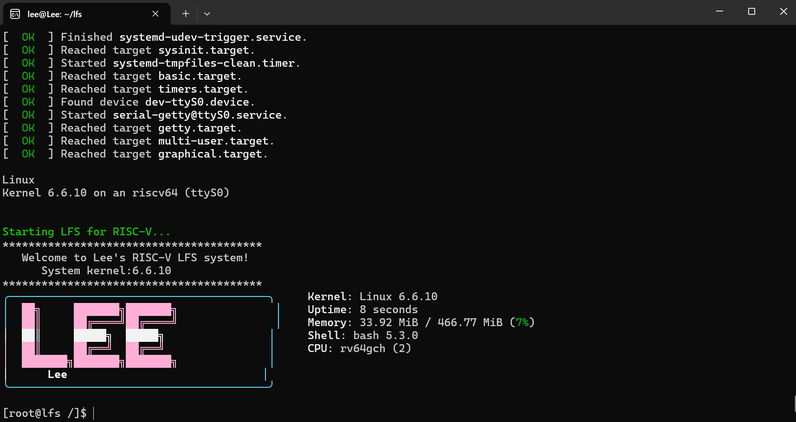

# Leetfs 的试炼记录

## 基本信息

- GitHub ID: Leetfs
- 联系邮箱: <lee@mtftm.com>
- rootfs 发布 Repo: <https://github.com/Leetfs/lfs-riscv>

## Rootfs 资产

- 文件名: rootfs-riscv64-lfs-Leetfs.tar.zst
- SHA256: a7fb2bcddf141219701937f4565ec2dfe7208bb3a19fb9ee667c34fd34779e0d

## 如何从 rootfs 运行起来

```bash
# 下载 -> 解压（略）

dd if=/dev/zero of=lfs-glibc-riscv64.img bs=1M count=1024
sudo /usr/sbin/mkfs.ext4 lfs-glibc-riscv64.img

sudo mkdir -p /mnt/tmp-boot

sudo mount -o loop lfs-glibc-riscv64.img /mnt/tmp-boot
sudo cp -a rootfs/* /mnt/tmp-boot/
sync
sudo umount /mnt/tmp-boot

qemu-system-riscv64 \
    -machine virt \
    -m 512M \
    -smp 2 \
    -bios default \
    -kernel Image \
    -drive file=$LFS/lfs-glibc-riscv64.img,format=raw,if=virtio \
    -append "root=/dev/vda rw console=ttyS0 init=/usr/lib/systemd/systemd" \
    -nographic
```

## fastfetch 证据



## 这是如何锻造的 (LFS 过程简述)

见 blog: <https://leetfs.com/tips/system/linux/riscv-lfs>

- 参考的教程/版本: [Linux From Scratch - Version r12.4-97-systemd](https://linuxfromscratch.org/lfs/view/systemd/)，Donz的文档，前人的PR/blog
- 关键配置: gcc 15.2.0, Linux kernel 6.6.10, libxcrypt 4.5.2, GNU Bash 5.3, GNU Coreutils 9.6, util-linux 2.39.3

## 踩过的坑

- 运行镜像时报错：Kernel panic: VFS unable to mount root

确认 `root=/dev/vda` 和 `CONFIG_VIRTIO_BLK=y` 都无问题，排查发现是运行时错误的使用 `-hda` 挂载文件系统，`-hda` 是一个历史兼容参数，会被转换为`-drive if=ide`，但 riscv virt 没 ide，就会报错卡住。

解决方案：改为 `-drive if=virtio`

- Systemd 部分测试项硬写入，关不掉，可使用某些方法绕过（见文档）

## 安全声明

- 我确认 rootfs 不包含任何密钥/Token/SSH Key/凭据/私人数据。
