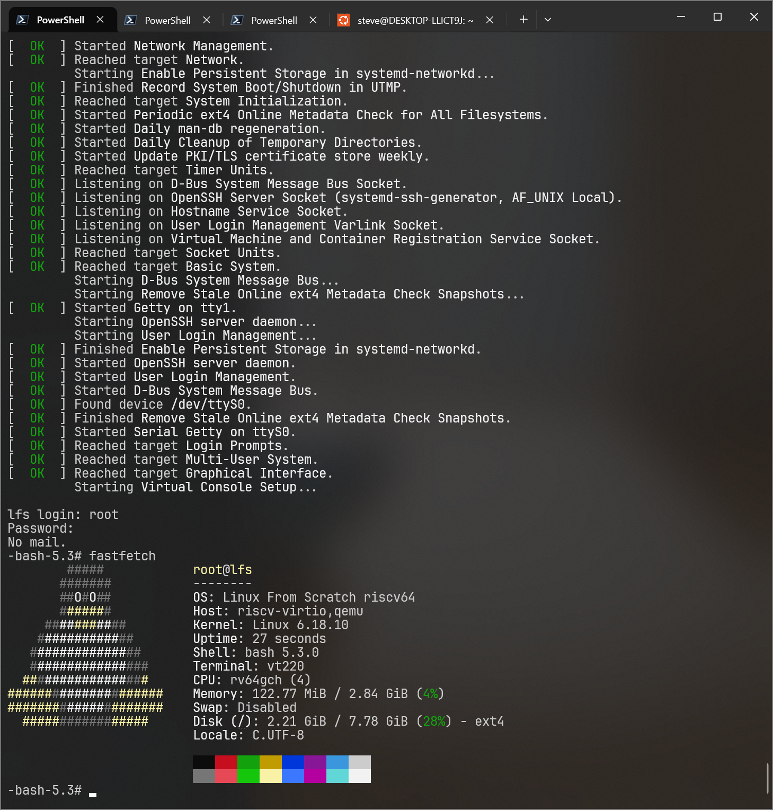
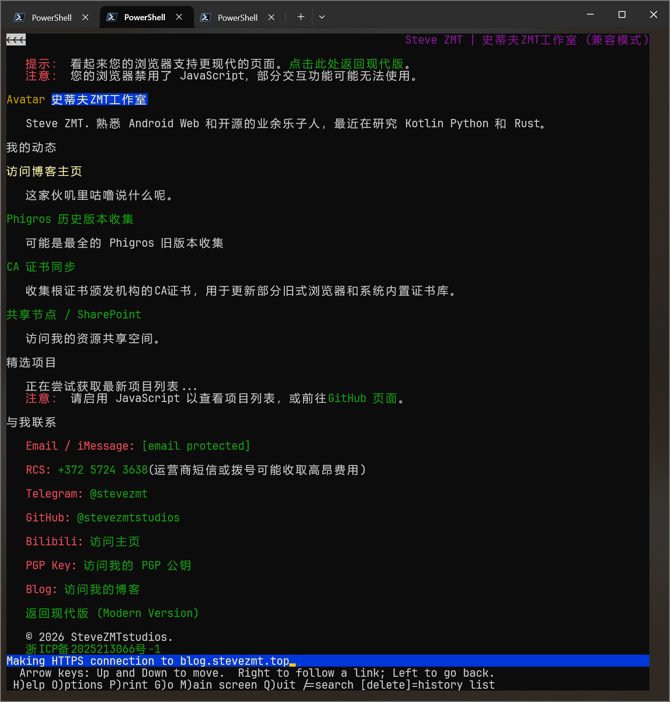

# SteveZMTstudios 的试炼记录

## 基本信息

- GitHub ID: SteveZMTstudios
- 联系邮箱: [me@stevezmt.top](mailto:me@stevezmt.top)
- rootfs 发布 Repo: https://github.com/SteveZMTstudios/riscv-lfs

## Rootfs 资产

| 文件 | 用途 | SHA256 |
|:--|:--|:--|
| [rootfs-riscv64-lfs-SteveZMTstudios.tar.zst](https://github.com/SteveZMTstudios/riscv-lfs/releases/download/v0.0.0/rootfs-riscv64-lfs-SteveZMTstudios.tar.zst) (~583 MB) | 归档 | 3de1788d618c182f959b2c2377b00efee4522f7b929f606a0b40d0b3e4c275e2 |
| [rootfs-riscv64-lfs-SteveZMTstudios.cpio.zst](https://github.com/SteveZMTstudios/riscv-lfs/releases/download/v0.0.0/rootfs-riscv64-lfs-SteveZMTstudios.cpio.zst) (~631 MB) | initramfs | 947d403c8b45b5880ce946d29ef97c506a438584dedd69582d33a6c877f06a87 |
| [vmlinuz-6.18.10-lfs-13.0-systemd](https://github.com/SteveZMTstudios/riscv-lfs/releases/download/v0.0.0/vmlinuz-6.18.10-lfs-13.0-systemd) (~23 MB) | 内核 | 2b61c6dda6eba037d53575f4c3fb19fb81cdb3c2ad1096858395a1617f2d0115 |

## 如何从 rootfs 运行起来

> 目标：从"下载 rootfs"到"进入环境并跑起 fastfetch"的最短步骤。

### 前置条件

- 宿主机：Windows / Linux / macOS，QEMU ≥ 8.0 已安装
- RAM ≥ 8 GB（initramfs 方式）或 ≥ 4 GB（磁盘方式）

### 方式 1：initramfs

需要 8GB 或更多内存。

从 [Releases](https://github.com/SteveZMTstudios/riscv-lfs/releases) 下载 `vmlinuz-6.18.10-lfs-13.0-systemd` 和 `rootfs-riscv64-lfs-SteveZMTstudios.cpio.zst`，放在同一个目录下。

```powershell
# Windows PowerShell
qemu-system-riscv64.exe `
  -machine virt `
  -cpu rv64 `
  -smp 4 `
  -accel tcg,thread=multi `
  -m 8G `
  -kernel .\vmlinuz-6.18.10-lfs-13.0-systemd `
  -initrd .\rootfs-riscv64-lfs-SteveZMTstudios.cpio.zst `
  -append "console=ttyS0 rdinit=/usr/lib/systemd/systemd" `
  -nographic
```

```bash
# Linux / macOS
qemu-system-riscv64 \
  -machine virt \
  -cpu rv64 \
  -smp 4 \
  -accel tcg,thread=multi \
  -m 8G \
  -kernel ./vmlinuz-6.18.10-lfs-13.0-systemd \
  -initrd ./rootfs-riscv64-lfs-SteveZMTstudios.cpio.zst \
  -append "console=ttyS0 rdinit=/usr/lib/systemd/systemd" \
  -nographic
```

### 方式 2：磁盘镜像

从 [Releases](https://github.com/SteveZMTstudios/riscv-lfs/releases) 下载 `rootfs-riscv64-lfs-SteveZMTstudios.tar.zst` 和 `vmlinuz-6.18.10-lfs-13.0-systemd`。

```bash
# 解压 + 创建磁盘镜像
tar -xf rootfs-riscv64-lfs-SteveZMTstudios.tar.zst
qemu-img create lfs-riscv64.img 8G

sudo losetup --show -fP lfs-riscv64.img
sudo fdisk /dev/loop0 << EOF
n
p
1


w
EOF

sudo mkfs.ext4 /dev/loop0p1
sudo mount /dev/loop0p1 /mnt/lfs-riscv64
sudo cp -a rootfs-riscv64-lfs-SteveZMTstudios/* /mnt/lfs-riscv64/
sudo umount /mnt/lfs-riscv64
sudo losetup -d /dev/loop0
```

```powershell
# Windows PowerShell — 启动
qemu-system-riscv64.exe `
  -machine virt `
  -cpu rv64 `
  -smp 4 `
  -accel tcg,thread=multi `
  -m 3G `
  -kernel .\vmlinuz-6.18.10-lfs-13.0-systemd `
  -append "root=/dev/vda1 rw console=ttyS0" `
  -drive file=lfs-riscv64.img,format=raw,if=none,id=hd `
  -device virtio-blk-device,drive=hd `
  -netdev user,id=net0,hostfwd=tcp:127.0.0.1:22222-:22 `
  -device virtio-net-device,netdev=net0 `
  -nographic
```

```bash
# Linux / macOS — 启动
qemu-system-riscv64 \
  -machine virt \
  -cpu rv64 \
  -smp 4 \
  -accel tcg,thread=multi \
  -m 3G \
  -kernel ./vmlinuz-6.18.10-lfs-13.0-systemd \
  -append "root=/dev/vda1 rw console=ttyS0" \
  -drive file=lfs-riscv64.img,format=raw,if=none,id=hd \
  -device virtio-blk-device,drive=hd \
  -netdev user,id=net0,hostfwd=tcp:127.0.0.1:22222-:22 \
  -device virtio-net-device,netdev=net0 \
  -nographic
```

### 登录

用户名 `root`，密码 `000000`。方式 2 可用 SSH：

```bash
ssh -p 22222 root@localhost
```

---

## fastfetch / neofetch 证据




---

## 这是如何锻造的（LFS 过程简述）

- 参考的教程/版本: [LFS 13.0-systemd](https://linuxfromscratch.org/lfs/view/13.0-systemd/) , [BLFS 13.0-systemd](https://linuxfromscratch.org/blfs/view/13.0-systemd/), [LFS Cross Version r12.4-130](https://www.linuxfromscratch.org/~xry111/lfs/view/clfs-ng-systemd/), [purofle/riscv-lfs](https://github.com/purofle/riscv-lfs) 
- 关键配置: `systemd 259`, `gcc 15.2`, `glibc 2.43`, `Linux 6.18.10`, `OpenSSH 10.2p1`, `Git 2.53`, `screen 5.0.1`
- 与"原教旨 LFS"的偏离:
  - **实际实施的是CLFS步骤**，因为 LFS 手册假定 host=target=x86_64，跨架构必须参考 CLFS 进行交叉编译
  - Meson 构建的包（Kmod、Systemd、D-Bus）需显式传 `--libdir=lib` 避免 riscv64 上库装到 `/usr/lib64/`
  - 内核用 Ubuntu 的 `gcc-riscv64-linux-gnu` 交叉编译器在宿主上编译

## 你踩过的坑

1. WSL内的QEMU User会因为未知原因悄无声息地被WSLInterop干掉，dmesg和journalctl都无任何记录，导致chroot中运行任何riscv64二进制都会出现"Exec format error"的错误，已向WSL报告问题。
2. 若在外置NTFS磁盘上构建rootfs，在构建Glibc时100%出现``undefined reference to `__lll_lock_wake_private'``，原因是Linux的大小写敏感和NTFS的大小写不敏感冲突导致Glibc构建过程中生成的符号表被污染，并且wsl操作挂载的`/mnt`效率额外低，只能在WSL内置的ext4文件系统中构建。
3. 搜索解决方案时应当排除所有简体中文的搜索结果。CSDN/博客园等平台上的 LFS"教程"多为 AI 生成或过时内容，命令和版本号几乎是错的。
4. chroot时无输出时可以试着在虚空输入`id`并回车，如果输出了ID说明其实是bash没有交互，将`/bin/bash`替换为`/bin/bash -i`即可。

## 自由发挥 / 花活展示

- `root/testpkg.sh` 内保留了在chroot环境下测试安装系统关键组件的检查，验收和烟雾测试脚本（201 PASS / 0 FAIL）。
- 适当的BLFS延伸，SSH Git Wget Curl lynx net-tools 等网络工具都已安装，除了没有 xfce 等图形界面之外基本上可以当作一个正常的 Linux 系统使用了，如果能找到一块 RISC-V 开发板解决引导和驱动直接烧录运行就更好了。

## 安全声明

- 我确认 rootfs 不包含任何密钥/Token/SSH Key/凭据/私人数据。
