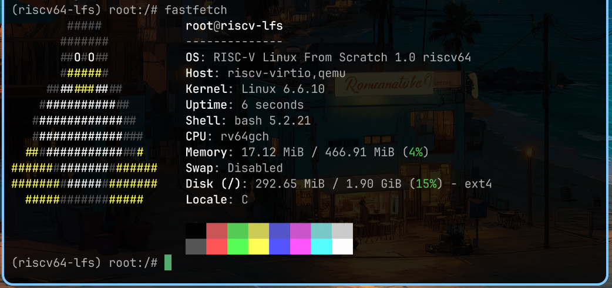

# cl2t 的试炼记录

## 基本信息

- GitHub ID: cl2t
- 联系邮箱: cl_2@outlook.com 
- rootfs 发布 Repo: https://github.com/cl2t/riscv-lfs

## Rootfs 资产

- 文件名: rootfs-riscv64-lfs-young.tar.zst
- SHA256: 34ce73023021216111104496241c8ff59f310ad170f68d2b57e569f8d8de9eba

## 如何从 rootfs 运行起来

> 目标：从"下载 rootfs"到"进入环境并跑起 fastfetch"的最短步骤。
> 验收底线：任何人下载你的 Release 资产后，按本节步骤执行，必须能跑起来。

### 前置条件

- QEMU >= 8.0（需要 `qemu-system-riscv64`）
- `mke2fs`（e2fsprogs 包）
- `zstd`（解压用）

### 方式 1（磁盘镜像启动）

1. 下载 rootfs 和 Image:
```bash
wget https://github.com/cl2t/riscv-lfs/releases/download/v1.0/rootfs-riscv64-lfs-young.tar.zst
wget https://github.com/cl2t/riscv-lfs/releases/download/v1.0/Image
```

2. 解压 rootfs 并创建磁盘镜像:
```bash
mkdir rootfs && tar -xf rootfs-riscv64-lfs-young.tar.zst -C rootfs
qemu-img create lfs-riscv64.img 2G
mke2fs -t ext4 -d rootfs -L riscv-lfs -r 1 -N 0 lfs-riscv64.img -E root_owner=0:0
```

3. 启动 QEMU:
```bash
qemu-system-riscv64 \
  -machine virt \
  -m 512M \
  -bios default \
  -kernel Image \
  -append "root=/dev/vda rw init=/init console=ttyS0" \
  -drive file=lfs-riscv64.img,format=raw,id=hd0,if=none \
  -device virtio-blk-device,drive=hd0 \
  -nographic
```

4. 进入系统后运行 `fastfetch` 查看系统信息。

5. 退出 QEMU: `Ctrl+A X`

## fastfetch 证据



## 这是如何锻造的（LFS 过程简述）

- 参考的教程/版本: CLFS 方法论 + LFS 官方文档 + 仓库 readme.md 三段式构建方法论
- 关键配置:
  - Toolchain: binutils 2.42 + GCC 13.2.0（三阶段构建）
  - C 库: glibc 2.40
  - 内核: Linux 6.6.10（RISC-V defconfig + VirtIO/串口/EXT4）
  - Init: 自定义静态编译 C 程序（挂载 proc/sys/tmp/run，启动 bash）
  - 用户态: bash 5.2.21 + coreutils 9.4 + util-linux 2.39.3
  - 花活: fastfetch 2.34.1 预编译二进制
- 与"原教旨 LFS"的偏离:
  - 未使用 systemd，改用静态编译的自定义 init 程序
  - poweroff/reboot 使用 reboot() 系统调用而非 systemctl
  - 原因：systemd 依赖链极其复杂（meson, ninja, libcap, dbus 等），在纯交叉编译环境下构建难度很高

## 你踩过的坑

- 坑 1: binutils 2.42 的 gprofng 组件与 GCC 15 宿主机不兼容，编译报大量类型错误。解决：`--disable-gprofng`。
- 坑 2: GCC Pass 1 只编译 `all-gcc` 不够，glibc 链接时报 `cannot find -lgcc`。解决：必须额外 `make all-target-libgcc && make install-target-libgcc`。
- 坑 3: bash 5.2.21 的 `mkbuiltins` 工具使用 K&R 风格函数声明，GCC 15 默认 `-std=gnu23` 不兼容。解决：`make "CC_FOR_BUILD=gcc -std=gnu17"`。
- 坑 4: GCC Pass 3 的 libsanitizer 在交叉编译环境下编译失败。解决：`--disable-libsanitizer`。
- 坑 5: util-linux 安装时 setuid/chgrp 权限错误（非 root 用户构建时常见）。解决：手动从 `.libs/` 复制实际 ELF 二进制文件。
- 坑 6: initramfs 方式启动时，rootfs 过大（~95MB）在 512MB 内存下解压失败（`Initramfs unpacking failed: write error`）。解决：改用磁盘镜像方式启动。

## 已知问题 / TODO

- 未集成 systemd（使用了自定义 init）
- `bash: no job control in this shell`（串口控制台无完整 TTY 分配，不影响使用）
- 未构建 `${CLFS}/tools/` 目录下的 riscv64 原生工具链（直接在宿主机交叉编译完成所有构建）

## 自由发挥 / 花活展示

- 我额外做了什么：用静态编译的 C 程序替代 shell 脚本作为 init，同时静态编译了 poweroff 和 reboot 工具
- 这样做的动机与取舍：shell 脚本 init 依赖动态链接的 mount 命令，在 PID 1 早期阶段动态链接器可能无法正常工作。静态 C 程序直接调用系统调用，零依赖，启动更可靠
- 关键实现：init.c 调用 `mount()` 挂载 proc/sys/tmp/run，然后 `execl()` 到 bash；poweroff.c 调用 `reboot(RB_POWER_OFF)`
- 如何复现与验证：启动后运行 `mount` 确认 proc 已挂载，运行 `poweroff` 确认内核输出 `reboot: Power down`
- 结果对比：shell 脚本 init 无法挂载 proc（mount 返回 127），静态 init 100% 可靠挂载
- 风险与回滚方式：如需回退，将 `/init` 替换为 shell 脚本并确保 mount 在 PATH 中即可

## 安全声明

- 我确认 rootfs 不包含任何密钥/Token/SSH Key/凭据/私人数据。
