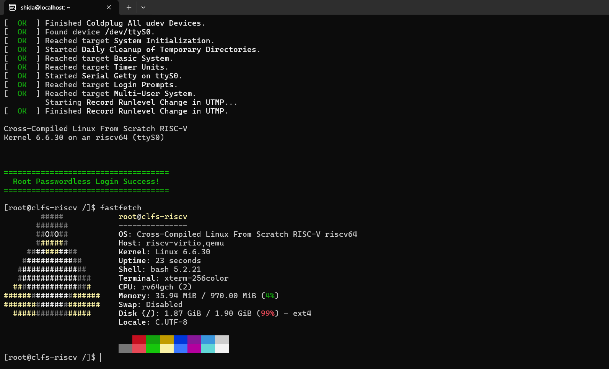

# corestudy 的试炼记录

## 基本信息

- GitHub ID: corestudy
- 联系邮箱: 2760018909@qq.com
- rootfs 发布 Repo: https://github.com/corestudy/RISC-V-From-Scratch

## Rootfs 资产

- 文件名: rootfs-riscv64-lfs-corestudy.tar.zst
- SHA256: 712b15c7d42193a0eb7c56e9166dfa702eef533e194be940228ee60880066013 

## 如何从 rootfs 运行起来

> 目标：从“下载 rootfs”到“进入环境并跑起 fastfetch/neofetch”的最短步骤。
> 验收底线：任何人下载你的 Release 资产后，按本节步骤执行，必须能跑起来。

解压发布包
首先，解压下载的压缩包并进入 cls 目录：

tar -I zstd -xvf rootfs-riscv64-lfs-corestudy.tar.zst

### 方式 1: 使用 QEMU 系统模式

'''bash

dd if=/dev/zero of=rootfs.ex4 bs=1M count=2048
sudo /usr/sbin/mkfs.ext4 rootfs.ex4
sudo mkdir -p /home/shida/clfs/tmp
sudo mount -o loop rootfs.ex4 /home/shida/clfs/tmp
sudo cp -a rootfs/* /home/shida/clfs/tmp
sudo umount /home/shida/clfs/tmp

qemu-system-riscv64   \
    -machine virt  \
    -cpu rv64    \
    -smp 2     \
    -m 1G     \
    -nographic     \
    -kernel ./Image     \
    -drive file=${CLFS}/rootfs.ext4,format=raw,id=hd0     \
    -device virtio-blk-device,drive=hd0   \
    -netdev user,id=net0   \
    -device virtio-net-device,netdev=net0    \
    -object rng-random,filename=/dev/urandom,id=rng0   \
    -device virtio-rng-pci,rng=rng0    \
    -append "root=/dev/vda rw console=ttyS0 loglevel=3 systemd.show_status=true"
'''

<!-- 可选区 -->

## fastfetch 证据

<!-- 此处插入截图（可选） -->

## 这是如何锻造的（LFS 过程简述）

- 参考的教程/版本: RISC-V-From-Scratch / CLFS
- 关键配置（toolchain / glibc / 内核 / systemd / 包策略等）:
    glibc-2.39              
    bash-5.2.21                
    util-linux-2.39.3
    coreutils-9.4         
    grep-3.11            
    riscv64-cross.txt   
    binutils-2.42              
    sed-4.9
    gcc-13.2.0            
    linux-6.6.30         
    systemd-255

## 你踩过的坑

登陆时死循环：systemd的动态库错误，没有shadow。Systemd 能拉起了登录界面（agetty），但是无法调用底层的 /bin/login 程序。导致一直死循环。 \
为了实现root 免密登录，我写了一个脚本绕过/bin/login，让agetty直接调用root的bash

## 已知问题 / TODO（如有）

- ...

## 安全声明

- 我确认 rootfs 不包含任何密钥/Token/SSH Key/凭据/私人数据。